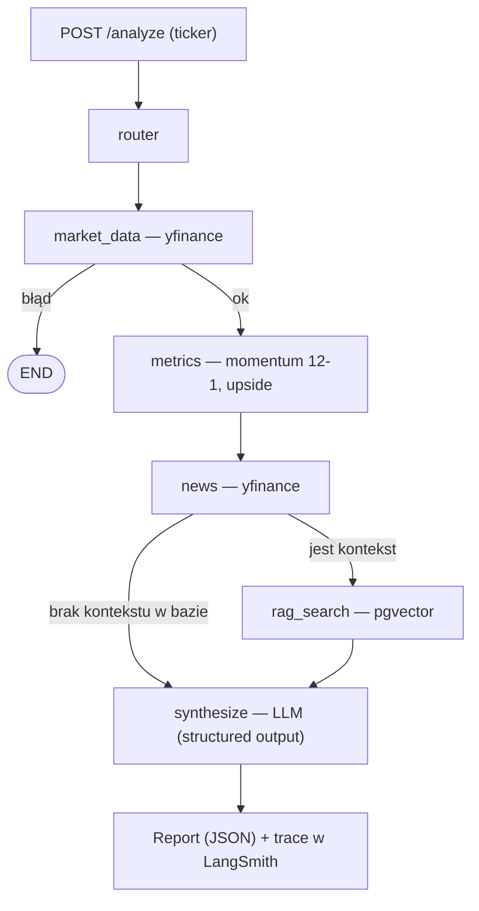

# Equity Research Agent

Agentowy system analizy spółek giełdowych oparty o LLM. Dla podanego **tickera**
agent (LangGraph) orkiestruje narzędzia: pobiera dane rynkowe, liczy metryki
(momentum, upside vs konsensus analityków), pobiera newsy, wyszukuje kontekst w
bazie wektorowej (RAG/pgvector) i przez LLM składa **ustrukturyzowany raport**.

> ⚠️ **Disclaimer:** To **narzędzie analityczne i projekt edukacyjny**, a **nie
> porada inwestycyjna**. Wyniki mogą być niekompletne i zawierać błędy/halucynacje
> modelu. Nie podejmuj decyzji inwestycyjnych na tej podstawie.

---

## Co ten projekt pokazuje

| Kompetencja | Gdzie w projekcie |
|---|---|
| **LangGraph / orkiestracja agentów** | Graf `router → tools → synthesize` z warunkowymi krawędziami (`app/agent/`) |
| **Tool-calling** | Narzędzia jako węzły: `market_data`, `metrics`, `news`, `rag_search` (`app/tools/`) |
| **RAG + baza wektorowa** | Świadomy chunking + embeddingi → **pgvector** (`app/rag/`) |
| **FastAPI** | Endpoint `POST /analyze` wystawiający agenta jako serwis (`app/main.py`) |
| **Observability** | **LangSmith** — trace każdego węzła grafu (`app/core/observability.py`) |
| **Ewaluacja LLM** | **LLM-as-judge** + sprawdzenia deterministyczne (`eval/`) |
| **Niezależność od dostawcy LLM** | Abstrakcja `LLMClient`: Groq (domyślnie), miejsce na OpenAI/Anthropic (`app/llm/`) |
| **Kontrola kosztów** | Limit tokenów, niska temperatura, lokalne embeddingi (offline) |
| **Docker** | `docker-compose`: aplikacja + PostgreSQL/pgvector |
| **Jakość i bezpieczeństwo** | `pytest`, `ruff`, `bandit`, `pip-audit`, walidacja wejścia |

---

## Architektura



**Kluczowe decyzje projektowe:**

- **Stan agenta** to jeden słownik (`AgentState`) wędrujący przez graf; każdy węzeł
  zwraca tylko swoją część, a LangGraph ją scala. Tak płynie informacja od pobrania
  danych do syntezy.
- **Router realnie decyduje o RAG**: węzeł `news` ma warunkową krawędź — RAG włącza
  się tylko, gdy w bazie jest kontekst dla danego tickera (`store.has_documents`).
- **Anty-halucynacja liczb**: metryki w raporcie pochodzą z **naszych obliczeń**, nie
  z LLM. Model dostaje policzone liczby i odpowiada wyłącznie za ocenę jakościową.
- **Świadomy chunking** (newsy): podział po zdaniach z nakładką + tytuł jako prefiks
  — zamiast naiwnego cięcia co N znaków, które rozrywa fakty i miesza dokumenty.
- **Degradacja, nie wywałka**: brak klucza LLM, bazy lub modelu embeddingów → atrapy;
  aplikacja zawsze wstaje.

---

## Szybki start (Docker)

```bash
cp .env.example .env        # uzupełnij GROQ_API_KEY (darmowy: console.groq.com)
docker compose up --build   # aplikacja + PostgreSQL/pgvector
```

API: <http://localhost:8000/docs> (interaktywny Swagger).

```bash
# Przykładowe wywołanie
curl -X POST http://localhost:8000/analyze \
  -H "Content-Type: application/json" \
  -d '{"ticker": "AAPL"}'
```

Przykładowa odpowiedź (skrót):

```json
{
  "recommendation": "Pozytywna",
  "rationale": "Momentum jest dodatnie, a upside vs konsensus powyżej zera...",
  "risks": ["Wzrost konkurencji", "Zmiany regulacyjne"],
  "metrics": { "momentum_12_1": 0.51, "upside": 0.06 },
  "news_used": ["..."],
  "disclaimer": "To narzędzie analityczne, nie porada inwestycyjna..."
}
```

### RAG — załadowanie kontekstu

```bash
# Pobiera newsy spółki, tnie na chunki, liczy embeddingi i zapisuje do pgvector.
docker compose exec app python -m app.rag.ingest AAPL NVDA
```

Po ingeście agent dla tych tickerów uruchomi ścieżkę z RAG.

---

## Uruchomienie lokalne (bez Dockera)

```bash
python -m venv .venv && source .venv/bin/activate
pip install ".[rag,dev]"
docker compose up -d db                 # sama baza pgvector (host: port 5433)
uvicorn app.main:app --reload
```

> Lokalny Postgres na 5432? Baza w kontenerze jest wystawiona na **5433**
> (`DATABASE_URL=...@localhost:5433/...`), żeby uniknąć kolizji.

---

## Metryki

- **Momentum 12-1** — zwrot ceny od ~12 do ~1 miesiąca wstecz. Pomijamy najnowszy
  miesiąc, bo w krótkim terminie występuje *short-term reversal* zaszumiający sygnał.
- **Upside** — `(cena docelowa konsensusu − cena bieżąca) / cena bieżąca`.

---

## Observability (LangSmith)

Trace przepływu agenta — każdy węzeł jako osobny span (czasy, wejścia, wyjścia).

```env
LANGSMITH_TRACING=true
LANGSMITH_API_KEY=ls__...
# Konta z UE:
LANGSMITH_ENDPOINT=https://eu.api.smith.langchain.com
```

Bez klucza trace jest cicho wyłączony — projekt działa bez konta LangSmith.

---

## Ewaluacja

```bash
python -m eval.run_eval            # cały dataset
python -m eval.run_eval AAPL MSFT  # wybrane tickery
```

Hybryda: sprawdzenia **deterministyczne** (disclaimer, obecność metryk) + **LLM-as-judge**
(trafność, kompletność, brak halucynacji liczb). Sędzią jest skonfigurowany LLM.

---

## Jakość i bezpieczeństwo

```bash
ruff check app eval tests      # lint + składnia
pytest -q                      # testy (logika liczona bez sieci)
bandit -r app eval             # skan bezpieczeństwa kodu
pip-audit                      # podatności zależności
```

- Zapytania SQL **parametryzowane** (brak konkatenacji), walidacja tickera na wejściu.
- Sekrety wyłącznie w `.env` (gitignored); w repo tylko `.env.example`.
- Świadome granice MVP: brak auth/rate-limiting na API (do dołożenia w produkcji).

---

## Struktura

```
app/
├── main.py             # FastAPI: /health, /analyze
├── agent/              # LangGraph: state, nodes, graph
├── tools/              # market_data, metrics, news, rag
├── llm/                # abstrakcja LLMClient (Groq/…)
├── rag/                # embeddings, store (pgvector), ingest
└── core/               # config, observability
eval/                   # dataset.jsonl + run_eval.py (LLM-as-judge)
tests/                  # testy jednostkowe (bez sieci)
```

---

## Stack

LangGraph · FastAPI · Groq (Llama) · pgvector · sentence-transformers · yfinance ·
LangSmith · Docker · pytest/ruff/bandit
